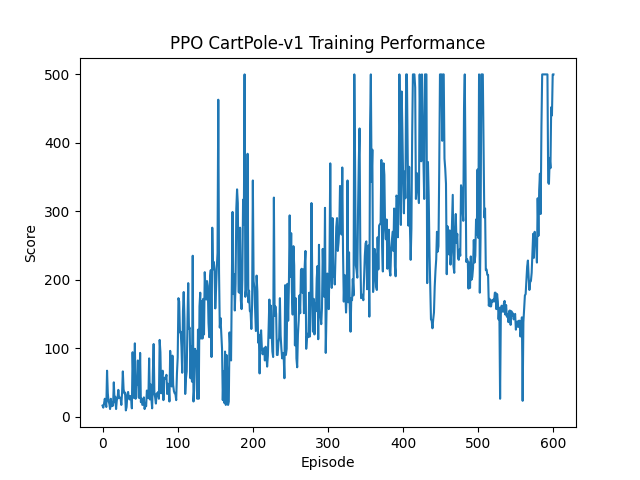
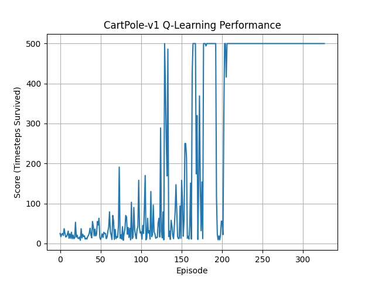
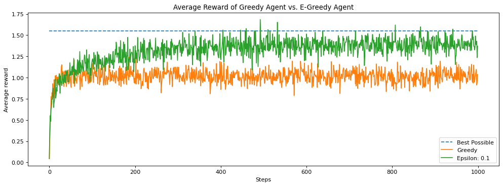
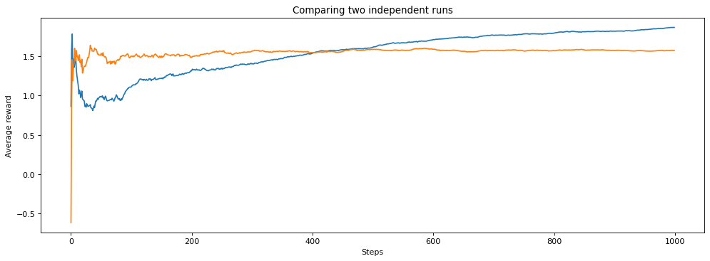
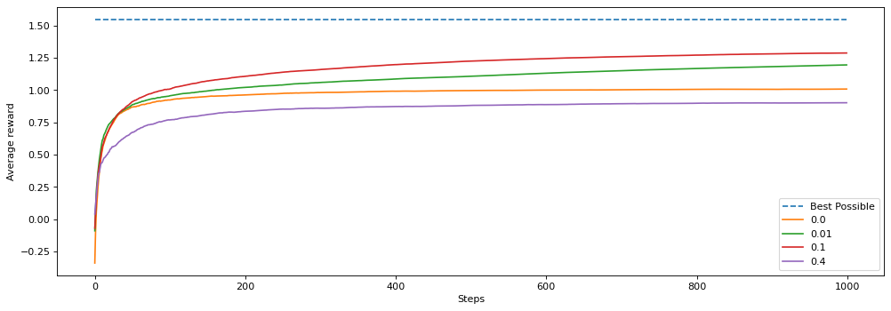
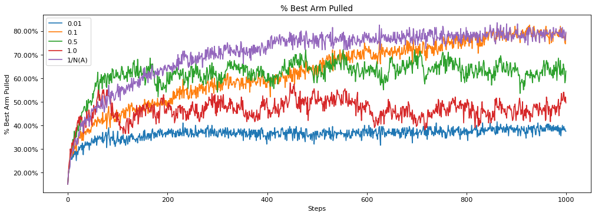
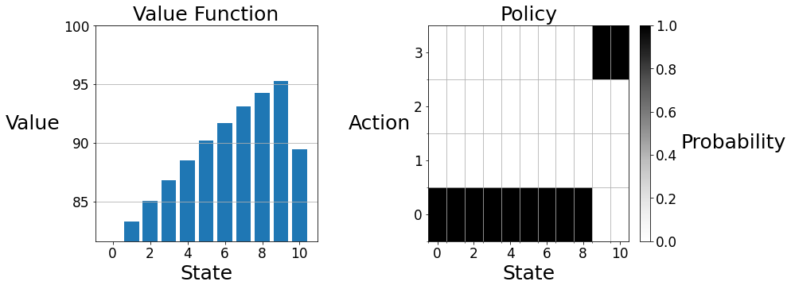

# ReinforcementLearning: Bridging Mathematical Foundations and Deep Reinforcement Learning.


## 📺 Demonstration

https://github.com/user-attachments/assets/788b38a7-cef0-4a6e-8d4d-079dcf8c83ed


<div align="left">
  <h3>PPO-Episode 500</h3>
  <video src="[https://github.com/YOUR-VIDEO-LINK-HERE](https://github.com/user-attachments/assets/788b38a7-cef0-4a6e-8d4d-079dcf8c83ed
).mp4" width="400" controls></video>
</div>
---

### 📈 Performance Overview
| Algorithm | Architecture | Learning Type | State Space |
| :--- | :--- | :--- | :--- |
| **Multi-Armed Bandit** | Tabular | Stateless | N/A |
| **Value Iteration** | Model-Based | Planning | Discrete |
| **Q-Learning** | Tabular TD | Model-Free | Discretized |
| **PPO / DQN** | Neural Network | Deep RL | Continuous |

---
## Performance



This repository serves as a comprehensive exploration of **Reinforcement Learning (RL)**, tracing the evolution of autonomous decision-making from foundational uncertainty to high-dimensional neural control. By implementing a diverse array of algorithms—from **Multi-Armed Bandits** to **Proximal Policy Optimization (PPO)**—this project demonstrates how agents can independently discover the "hidden laws" of economics and physics through pure trial-and-error.

---

## 🧠 The Core Logic: The Incremental Update Rule
Regardless of complexity, every agent in this project is driven by a single, universal mathematical backbone. This "incremental mind" allows the agent to bridge the gap between current knowledge and future optimal behavior:

$$\text{NewEstimate} \leftarrow \text{OldEstimate} + \alpha \times [\text{Target} - \text{OldEstimate}]$$

By manipulating the **Target** (from immediate rewards to discounted future values) and the **Step-Size ($\alpha$)**, we scale intelligence from simple state-less decisions to complex, continuous control.

---
### 🗺️ Phase 1: The Foundation — Decisions Under Uncertainty
**Environment:** Multi-Armed Bandits (Stateless)  
**Key Concept:** The Exploration-Exploitation Trade-off

The journey begins with the simplest form of RL: picking the best "arm" without an environmental state. Here, we master the $\epsilon$-Greedy strategy.

```python
if np.random.random() < self.epsilon:
    current_action = np.random.randint(0, len(self.q_values)) # Exploration
else:
    current_action = np.argmax(self.q_values) # Exploitation
```

* **Managing Stochasticity:** We average over 200 independent runs to wash out random fluctuations and see the "big picture."
* **Optimal $\epsilon$:** Testing revealed that 10% (0.1) is the "sweet spot" for balancing discovery with profit.
* **Step Size Logic:** We found that decaying step sizes ($1/N(A)$) excel in stationary worlds, while constant step sizes are required for the non-stationarity of the real world.

---

### 🗺️ Phase 2: The Architecture — Structured Worlds (MDPs)
**Environment:** GridWorld City (ParkingWorld)  
**Key Concept:** Planning via the Bellman Equations

We move from "arms" to **States**. Actions now have consequences that change the environment (e.g., setting a low price increases parking occupancy).

**The Math of Planning**
We implement Policy Iteration and Value Iteration using the Bellman Optimality Equation:
$$\huge v(s) \leftarrow \max_a \sum_{s', r} p(s', r | s, a)[r + \gamma v(s')] $$

> **The Emergent Discovery:** Without any pre-programmed knowledge of economics, the agent independently discovered **Surge Pricing**. It jacked up prices at State 9 ("The Sweet Spot") to prevent the city from falling into the State 10 "Penalty Zone."

---

### 🗺️ Phase 3: The Discovery — Model-Free Learning (Tabular)
**Environment:** CartPole-v1  
**Key Concept:** Discretization & Temporal Difference (TD) Learning

In this phase, we no longer have a "map" ($p$) of the world. The agent must learn by doing.

* **The Bucket Strategy:** Since the CartPole state space is infinite/continuous, we use `state_to_bucket()` to discretize it into 18 distinct scenarios.
* **The Update:** We use the TD-error to update the Q-Table in real-time:
```python
q_table[state_0 + (action,)] += learning_rate * (reward + discount_factor * (best_q) - old_q)
```
*Note: This is the Incremental Update Rule in its purest form.*

---

### 🗺️ Phase 4: The Scale — Deep Reinforcement Learning
**Environment:** CartPole-v1 (Continuous)  
**Algorithms:** DQN & PPO  
**Key Concept:** Neural Function Approximation

Finally, we remove the "buckets." When the state space is too large for a table, we use Neural Networks to approximate values.

* **DQN:** Utilizes a **Replay Buffer** to break the correlation between consecutive experiences, stabilizing the "OldEstimate" during training.
* **PPO:** Introduces an **Actor-Critic** architecture. The "Actor" proposes actions while the "Critic" evaluates them, using a clipped objective function to ensure training updates aren't too aggressive.

### Deep Q-Network (DQN) Core Logic

**The DQN Target (The "True" Score):**
$$Y = r + \gamma \max_{a'} Q_{target}(s', a')$$

**The DQN Loss (The Error):**
$$Loss = (Q_{current}(s, a) - Y)^2$$

*How it works:*

The neural network looks at its prediction ($Q_{current}$), compares it to what actually happened plus the future estimate ($Y$), and tweaks its weights to make the error smaller next time.
---

### 📚 References & Acknowledgments
* Theory derived from *Fundamentals of Reinforcement Learning* (University of Alberta & Amii).
* Code structures inspired by `minimalRL`.


### 1. The Epsilon-Greedy Agent

The Epsilon-Greedy agent balances exploration and exploitation. Here is the core logic:

```python
# For an epsilon-greedy agent: 
if np.random.random() < self.epsilon:
    # Exploration with probability: epsilon
    # Find action arm completely at random
    current_action = np.random.randint(0, len(self.q_values))
else:
    # Exploitation: pick the best known action
    current_action = np.argmax(self.q_values)
```

**Main Simulation Parameters:**
* **Number of Independent runs:** 200
* **Time steps per run:** 1000
* **Exploration Probability ($\epsilon$):** 10% (0.1)


---

### 2. Managing Randomness & Stochasticity

A random simulation with an epsilon-greedy agent relies on several random elements:
* The decision to explore.
* The random action chosen initially.
* Tie-breaking (when multiple actions have the same `argmax` value).
* Reward distribution (randomly sampled from a Gaussian).

**Wiping out random fluctuation:**
To wash out noise and see the "big picture," we rely on the power of averaging.
* We average across 200 independent runs: `np.mean(all_reward, axis=0)`
* Tracking the cumulative average helps smooth out the stochasticity of individual seeds.

**Are statistical significance tests needed?** No. Because we have access to simulators for our experiments, we use the simpler strategy of running for a large number of runs and ensuring that the confidence intervals do not overlap.

**Performance Visualization (Averaged vs. Individual Runs)**

* **Averaged performance:** Shows the smooth trend of the 0.1 epsilon agent over many runs.
* **The inherent noise:** Becomes obvious when viewing only two individual runs.



---

### 3. Comparing Values of Epsilon

Testing epsilons = [0.0, 0.01, 0.1, 0.4] revealed that 10% exploration (0.1) is the best performing parameter for this setup.

* **0.1 (10%):** Optimal balance.
* **0.01 (1%):** Explores too little and takes too long to find the best arm; still in the discovery phase by step 1000.
* **0.4 (40%):** Spends too much time choosing randomly, picking suboptimal arms too frequently.


---

### 4. The Effect of Step Size

We evaluated how different step sizes impact the agent's ability to lock onto the true expected value.

**Tested step sizes:** [0.01, 0.1, 0.5, 1.0, $1/N(A)$]

```python
# Measuring the amount of time the best action is taken
if action == best_arm:
    best_action_chosen.append(1)
else:
    best_action_chosen.append(0)

if run == 0:
    q_values[step_size].append(np.copy(rl_glue.agent.q_values))
    
best_actions[step_size].append(best_action_chosen)
ax.plot(np.mean(best_actions[step_size], axis=0))
```

**Step Size Performance Comparison**

Conclusions on Step Size for 1000 steps: $1/N(A) > 0.1 > 0.5 > 1.0 > 0.01$

* **$1/N(A)$ (Decaying step size):** Performs best in stationary environments. It moves quickly at first but reduces later, making it less susceptible to the stochasticity of rewards.
* **0.5 & 1.0 (Large step sizes):** Overcorrect and oscillate. Highly susceptible to stochasticity.
* **0.1 (Moderate step size):** Moves steadily and does not oscillate wildly.




> **Note:** While a decaying step size ($1/N(A)$) converges without oscillating, it cannot adapt to changes in the environment. Nonstationarity is a common feature of online reinforcement learning problems, where a constant step size (like 0.1) often becomes necessary to adapt to shifting reward distributions.
## Reference 
https://github.com/seungeunrho/minimalRL


# Grid World City: Optimizing Street Parking with Reinforcement Learning 🚗💰

This project demonstrates the power of Reinforcement Learning (RL) by solving a real-world economic problem: **City Street Parking**. 

Using **Markov Decision Processes (MDPs)**, we built an AI agent that independently discovers the concepts of **Supply and Demand** and **Surge Pricing** without any prior knowledge of economics. The agent learns to dynamically adjust parking prices to maximize city utility and revenue.

---

### 🏙️ The Environment: ParkingWorld
The simulation models a city street with 10 parking spaces and 4 price tiers.

* **States ($S$):** The number of cars currently parked [0, 1, 2... 10].
* **Actions ($A$):** The price point the city sets for the next hour [0=Cheap, 1, 2, 3=Expensive].
* **Transitions ($p$):** The "laws of physics/economics." If you set a low price, the probability of cars arriving increases. If you set a high price, the probability of cars leaving increases.
* **The Goal (Rewards):** The city wants to maximize social welfare. The highest reward is given when the street is almost full (the "Sweet Spot"), but a penalty is applied if the street becomes 100% full, as this causes traffic and driver frustration.

---

### 🧠 Section 1: Policy Evaluation
Before we can optimize our strategy, we need to know how to measure our current one. 

**Iterative Policy Evaluation** takes a specific policy (a set of rules) and calculates the exact expected long-term value of every state by looking into the future.

**The Bellman Expectation Equation:**
$$\huge v(s) \leftarrow \sum_a \pi(a | s) \sum_{s', r} p(s', r | s, a)[r + \gamma v(s')] $$

**How the code works:**
It loops through the environment, acting as a **Calculator**. For every state, it checks what actions the policy ($\pi$) dictates, looks at the possible outcomes ($p$), and calculates a weighted average of the immediate rewards ($r$) plus the discounted future value ($\gamma v(s')$).

---

### 📈 Section 2: Policy Iteration
Policy Iteration is a "two-step dance" that alternates between evaluating a policy and making it strictly better.

1.  **Complete Evaluation:** Sweep through the city dozens of times using the equation above until the value estimates ($V$) completely converge.
2.  **Complete Improvement (Greedification):** Freeze the value estimates. Look at every action available in state $s$, and update the policy to be 100% greedy with respect to the highest expected score.

**The Policy Improvement Equation:**
$$\huge \pi'(s) = \arg\max_a \sum_{s', r} p(s', r | s, a)[r + \gamma V(s')] $$

> **Note:** In the code, `evaluate_policy()` cares about the **Value** (updating $V[s]$ with the average score), while `q_greedify_policy()` cares about the **Index** (updating $\pi[s]$ to the action that triggered the highest score).

---

### ⚡ Section 3: Value Iteration
Policy Iteration is mathematically sound but slow. Why waste time perfectly evaluating a mediocre, average policy?

**Value Iteration** acts as the ultimate shortcut. Instead of evaluating a fixed policy, it assumes you are always going to pick the absolute best action. It merges evaluation and improvement into a single, aggressive step.

**The Bellman Optimality Equation:**
$$\huge v(s) \leftarrow \max_a \sum_{s', r} p(s', r | s, a)[r + \gamma v(s')] $$

**The Difference:** Notice how $\sum_a \pi(a | s)$ from Policy Iteration is replaced with $\max_a$. Instead of a weighted average, we simply grab the highest expected return and overwrite the value array in-place. We throw away the policy array entirely until the very end, extracting the optimal playbook only once the values have hit their absolute mathematical ceiling.

---

### 🎯 The Results: Discovering Supply and Demand



Both Policy Iteration and Value Iteration are mathematically guaranteed to arrive at the exact same optimal solution. Here is what the AI learned for a 10-space street:

| State (Occupancy) | Value (Long-term Reward) | Action (Optimal Price Tier) |
| :--- | :--- | :--- |
| 0 (Empty) | 81.6 | 0 (Cheapest) |
| ... | ... | 0 |
| 8 (Almost Full) | 94.3 | 0 (Cheapest) |
| **9 (The Sweet Spot)** | **95.3 (Peak Value!)** | **3 (Most Expensive)** |
| 10 (Penalty Zone) | 89.5 (Value drops) | 3 (Most Expensive) |

#### Interpretation of the Data:
1.  **The Value Function (The Climb & The Cliff):** The Value Function monotonically increases as more parking is used (from 81.6 up to 94.3), because empty streets generate zero utility. The value peaks exactly at State 9 (95.3). However, the moment the street hits State 10, the value plummets to 89.5 because of the 100% occupancy penalty.
2.  **The Policy (Automated Surge Pricing):** * **States 0-8:** The algorithm dictates **Action 0 (Cheap)**. The AI knows it needs to climb the value graph, so it lowers the price to mathematically increase the probability of cars arriving.
    * **States 9-10:** The exact second the street hits 9 cars, the AI slams the brakes and dictates **Action 3 (Surge Pricing)**. It jacks the price up to scare away new cars and encourage parked drivers to leave, forming a protective barrier that stops the city from falling off the "cliff" into State 10.

**Conclusion:** Good policies are policies that spend more time in desirable states and less time in undesirable states. Without any pre-programmed knowledge of economics, the Bellman equations successfully modeled the unwritten laws of supply and demand!


# Discussions
Q1> Compare bandits to supervised learning

A1> "Supervised Learning and the Bandit Problem are similar in decision optimization, as both use input-output mapping and probability distributions (like Softmax) to guide their choices without a pre-existing physical model to follow. However, they differ in how they use those probabilities: Supervised Learning uses them to match a known answer, whereas the Bandit Problem uses them for an active search, balancing exploration and exploitation to discover the best action through trial and error."